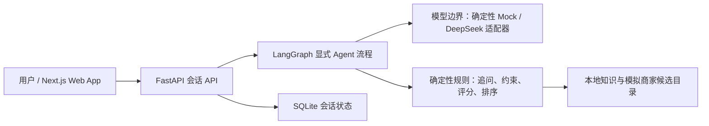

# 咕噜港｜AI 选宠顾问 Demo

一个面向养宠新手的多轮对话 Agent。它不会把用户丢进长问卷，而是从自然表达中逐步整理生活方式，动态决定下一问，再从模拟合作商家的候选宠物中给出“品种／类型方向 + 具体宠物档案”两层推荐。

> 当前是可运行、可测试的第一版 Web App。首页交易数字、商家和在售宠物均为明确标注的 Demo 虚拟数据；平台不直接销售，也不对个体健康或性格作绝对保证。

## 30秒介绍

咕噜港验证的不是“让AI随便推荐宠物”，而是怎样把新手模糊的生活描述，变成可检查的选宠建议。大模型负责听懂和表达；代码负责过敏与底线、动态追问、候选过滤、内部评分和排序；SQLite保存唯一会话状态。这样既保留真实对话感，又能用固定案例证明关键规则没有被模型的随机性带偏。

## 这个项目做深了什么

- 真实的多轮会话、24 小时本地会话引用与 SQLite 服务端状态
- 从自由文本提取用户画像，按缺失信息动态追问，支持 3+1 问题边界
- 硬约束、冲突、未知项、候选过滤、内部评分和匹配等级的确定性逻辑
- “方向 + 个体”双层推荐，同时解释合拍点、代价、不匹配点和待确认项
- 修改单项条件后重新推荐，主动重置、失败重试和过期保护
- 自动测试使用确定性 Mock，不消耗真实模型费用，也不会把随机回答当作正确答案

平台首页、搜索、人气榜、热门品种、合作商家、宠物市场、用品、社区、会员中心和“我的”共同构成完整产品外壳；真实交易、发帖、会员开通、订单和联系商家等未实现业务会明确提示“Demo演示功能，暂未开放”。

公开手机体验版：[gulu-harbor-demo.yuanchen863.chatgpt.site](https://gulu-harbor-demo.yuanchen863.chatgpt.site/)

公开体验版用于快速检查手机页面和原型交互；仓库中的 Next.js + FastAPI 工程还包含确定性 Mock Agent、SQLite 会话、完整测试和 DeepSeek 适配器，两者不要混为同一个部署形态。

## 架构与边界

详细说明见[技术架构](docs/architecture.md)和[产品决策记录](docs/decisions.md)。



模型只负责理解表达、润色问法和把已锁定的推荐事实整理成自然说明；硬约束过滤、候选名单、匹配等级与排序由可测试代码决定。当前浏览器 Demo 使用确定性 Mock；DeepSeek 适配器、无效响应最多一次重试和完整失败回滚已完成假HTTP集成测试。2026-09-05使用`DeepSeek-V4-Flash-0731`完成一条5轮真人流程，并分别验证推荐解释与安全复核。T35B已把这两步接入主API并以Mock完成回滚和手机浏览器验证；接线后尚未再次调用真人模型复跑。

## 已验证的演示路径

1. 从首页进入“AI选宠顾问”。
2. 用自己的话完成 5 轮动态对话。
3. 查看品种／类型方向和具体候选宠物两层结果。
4. 修改一个条件，看到系统重新计算推荐。
5. 模拟模型失败时，已有会话仍保留并可以原地重试。

当前完整前端已在`320×844`、`390×844`、`430×844`手机宽度及`1280×900`桌面视口检查；53条单元／组件测试和25条真实Chromium路径通过，另有1条桌面项目条件跳过，生产构建和Web App Manifest检查通过。独立公开手机体验版另有21条运行测试与4条站点规则测试；详细浏览器证据见`docs/qa/browser-check.md`。

## 本地运行

环境要求：Node.js 24、pnpm 11、Python 3.12、uv。

```powershell
powershell -ExecutionPolicy Bypass -File scripts\bootstrap.ps1
```

先启动不会联网的 Mock Agent 后端：

```powershell
Push-Location backend
uv run uvicorn app.demo:app --host 127.0.0.1 --port 8000
Pop-Location
```

再开一个终端启动前端：

```powershell
pnpm --dir frontend dev
```

浏览器打开 `http://127.0.0.1:3000`。

## 一键验证

```powershell
powershell -ExecutionPolicy Bypass -File scripts\verify.ps1
```

验证包含：OpenAPI 类型漂移、ESLint、TypeScript、前端单元／组件测试、手机与桌面真实浏览器流程、生产构建、Ruff、mypy、后端测试和覆盖率。

固定评测可以单独运行：

```powershell
Set-Location backend
uv run python ..\evaluation\run.py
```

自动化命令必须保持Mock模式，不会读取或调用真实DeepSeek Key。真人演示和Mock测试为什么分开，见[演示脚本](docs/demo-script.md)。

## 重要文档

- [产品与事实边界](PROJECT_CONTEXT.md)
- [已批准的规格](specs/SDD_SPEC.md)
- [实施计划](specs/IMPLEMENTATION_PLAN.md)
- [TDD 任务与证据](specs/TASKS.md)
- [技术架构](docs/architecture.md)
- [重要决策记录](docs/decisions.md)
- [真人模型观察](docs/evaluation/live-model-observations.md)
- [固定评测报告](docs/evaluation/report.md)
- [浏览器检查记录](docs/qa/browser-check.md)
- [演示脚本](docs/demo-script.md)

## 安全说明

- 真实 API Key 只能放在本机环境变量或未提交的 `.env` 中。
- `.env.example` 只提供变量名，不包含秘密。
- 自动化测试强制使用 Mock；不会调用 DeepSeek 或产生模型费用。
- 无账户会话按 24 小时规则处理，用户可以主动重置。

## 当前进度

Gate 0规格、Gate 1计划、UX-01和T06R至T43已完成；Phase 6真人演示、Phase 7前端外壳、固定Mock评测和T42浏览器审查已有证据。下一项是T44最终全量验证和用户验收。完整FastAPI、SQLite与DeepSeek后端尚未部署到公开网址；公开手机体验版仍是前端原型分享版，不能当作完整系统已经上线。
