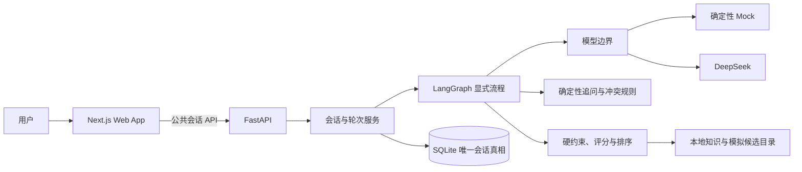
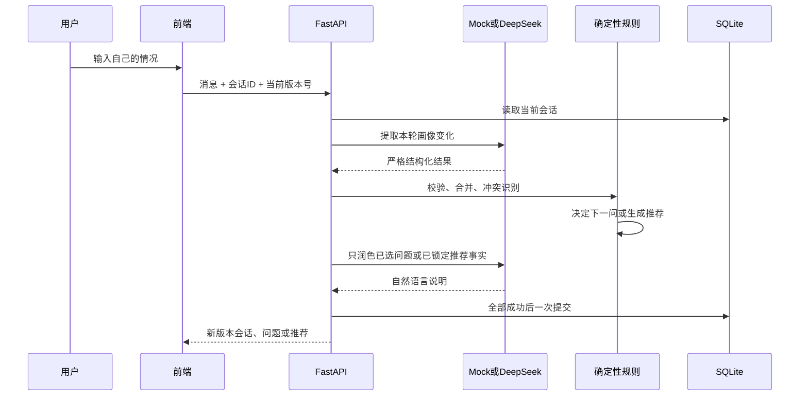

# 咕噜港技术架构说明

这份文档用尽量不依赖技术背景的方式说明：咕噜港第一版由哪些部分组成、每一部分负责什么，以及为什么要这样拆分。

## 1. 一句话理解架构

前端负责和用户聊天、展示画像与推荐；FastAPI负责接收请求；LangGraph按明确步骤组织流程；大模型理解和润色语言；确定性代码负责真正影响结果的追问选择、硬约束、评分和排序；SQLite保存唯一一份服务端会话状态。

## 2. 系统全貌



图里最重要的分界是：模型可以理解一句话，但不能偷偷改变问题、候选名单、匹配等级或排序。

## 3. 一轮对话怎样运行



如果模型超时、结构错误、知识缺失或安全复核失败，最后的SQLite提交不会发生。因此页面不会出现“这一半成功、另一半失败”的残缺会话。

## 4. 各层职责

| 层 | 主要职责 | 明确不能做什么 |
| --- | --- | --- |
| Next.js前端 | 展示首页、对话、画像、双层推荐和原型页面；保存会话ID与到期时间 | 不保存DeepSeek Key，不把完整画像当服务端真相 |
| FastAPI | 公共API、错误格式、请求ID、模型和仓储装配 | 不向页面泄漏内部精确分或服务器敏感信息 |
| LangGraph | 按当前状态执行“提取、校验、合并、评估、追问或匹配”等显式节点 | 不使用自由工具循环，不另存一份会话状态 |
| 模型提供方 | 提取本轮表达、润色已选问题、解释已锁定推荐、复核说明文字 | 不决定硬约束、下一问、分数、等级、候选或排序 |
| 确定性领域规则 | 冲突检测、3+1追问边界、硬约束、未知项处理、评分、排序和公开结果 | 不生成无来源的宠物档案 |
| 本地知识与目录 | 提供有ID的猫狗知识、8个方向、模拟商家和16只模拟候选档案 | 不在对话时临时编造候选 |
| SQLite | 保存完整会话快照、版本号、到期时间、幂等结果和重置墓碑 | 不与LangGraph或浏览器维持第二套真相 |

## 5. 为什么模型和规则必须分开

大模型擅长理解“我白天上班，但晚上愿意陪它”这种自然表达，也擅长把问题说得不那么像问卷；但同一句话在不同调用中可能出现细微变化。如果让模型直接决定硬约束和排名，测试就无法证明过敏底线一定不会被偏好分抵消。

因此本项目采用以下边界：

- 模型输出必须符合统一Schema，字段不对就整轮失败。
- 模型只能描述本轮用户消息，不能把旧话或别人的话混进画像。
- 下一问题由代码先选定，模型只能调整说法，不能换题或换快捷选项。
- 推荐候选、顺序和匹配等级由代码锁定后，模型才能整理解释。
- 推荐解释还要经过安全复核；无法安全替换时整轮回滚。

## 6. 为什么页面不展示数字分

内部数字分只是稳定排序工具，不是科学概率。比如内部82分不代表“82%适合”，也不能保证一只具体宠物的真实性格。

页面只展示四种容易理解的结论：

- 很合拍：当前已知条件整体一致。
- 值得认识：方向不错，但仍有重要信息需要确认，或存在用户已经接受的成立条件。
- 需要磨合：已经知道存在明显差距，需要真实调整才能相处。
- 暂不合适：触发过敏或用户明确底线，不进入正式推荐。

排序仍使用内部数字分，但公共API和页面都不能返回该数字。

## 7. 为什么SQLite是唯一真相

“唯一真相”是说：恢复会话、判断是否过期、解决重复提交和确认当前版本时，只认SQLite里的完整状态。

- 浏览器只保存`conversationId`和`expiresAt`，方便24小时内回来继续。
- LangGraph只计算这一轮应该发生什么，不使用checkpointer另存会话。
- 每次成功提交都检查`baseRevision`，避免两个旧页面互相覆盖。
- 同一个`clientMessageId`重复发送时返回已保存结果，避免重复生成一轮。
- 主动重置后写入墓碑，旧会话不能恢复或继续使用。

首版选择SQLite是因为它无需单独部署数据库，适合个人和身边朋友体验。它不是对未来大规模并发架构的承诺。

## 8. Mock与DeepSeek怎样替换

两者实现同一组模型接口：

1. 提取画像变化。
2. 润色已选问题。
3. 解释已锁定推荐事实。
4. 复核解释文字是否安全。

自动化测试使用确定性Mock：同一测试夹具永远给同一结构化输出，不联网、不消耗额度。真人演示使用DeepSeek：验证真实自然语言输入，但允许语言存在波动。更换模型只发生在这四个接口的外侧，领域规则和SQLite提交方式不变。

## 9. 公共API

| 方法与路径 | 用途 |
| --- | --- |
| `POST /api/v1/conversations` | 新建会话并返回第一问 |
| `GET /api/v1/conversations/{id}` | 恢复未过期会话 |
| `POST /api/v1/conversations/{id}/messages` | 提交一轮回答，返回下一问或推荐 |
| `PATCH /api/v1/conversations/{id}/profile` | 修改已确认条件并重新计算 |
| `GET /api/v1/conversations/{id}/recommendations` | 读取已经形成的推荐 |
| `DELETE /api/v1/conversations/{id}` | 主动重置并使旧会话失效 |
| `GET /health` | 检查服务与配置是否可用 |

请求使用版本号防止覆盖，响应带请求ID便于定位错误。OpenAPI快照生成前端类型，检查命令会阻止“后端已经改了、前端类型还没更新”的漂移。

## 10. 真实功能、原型功能和部署边界

| 能力 | 当前真实程度 |
| --- | --- |
| 多轮对话、画像、动态追问、匹配、解释、修改条件、重置 | 已编码并有Mock自动化与浏览器测试 |
| DeepSeek五轮对话 | 已做一次受控真人演示；推荐解释接线后尚未再次完整真人复跑 |
| 首页、市场、用品、社区、会员中心、我的 | 可点击前端原型，数据为明确标注的Demo虚拟数据 |
| 支付、下单、合同、物流、真实发帖、真实会员、真实商家联系 | 未实现，统一提示“Demo演示功能，暂未开放” |
| 公开网址 | 当前只发布前端原型分享版，不包含完整FastAPI、SQLite和DeepSeek后端 |
| PWA安装 | 清单与标准图标已通过浏览器检查；实体手机系统安装仍待完整HTTPS部署后手工确认 |

## 11. 目录地图

```text
frontend/                 Next.js页面、组件、浏览器测试
backend/app/api/          FastAPI公共接口与错误格式
backend/app/agent/        LangGraph节点和显式路由
backend/app/domain/       画像、追问、约束、匹配等确定性规则
backend/app/providers/    Mock、浏览器Demo Mock、DeepSeek适配器
backend/app/repositories/ SQLite仓储
backend/app/data/         知识、方向、模拟商家和模拟候选档案
evaluation/               固定评测集、运行器和原始结果
docs/evaluation/          Mock与真人结果说明
docs/qa/                  浏览器审查证据
specs/                    已批准规格、计划和任务证据
```

## 12. 当前验证证据

- 固定评测：36条案例，其中34条由38条生产业务回归测试执行并全部通过，Bad Case为0。
- 前端：53条单元／组件测试、25条Chromium路径通过，另有1条按桌面项目条件跳过。
- 浏览器：七个主要页面、320／390／430px手机宽度和1280px桌面视口已审查。
- 真人模型：2026-09-05使用`DeepSeek-V4-Flash-0731`完成一条5轮受控流程；接线后的完整真人复跑仍未执行。
- 最终项目总验证属于T44，T43不能提前宣布第一版已经最终验收。

相关证据：[固定评测报告](evaluation/report.md)、[真人模型观察](evaluation/live-model-observations.md)、[浏览器检查](qa/browser-check.md)。
