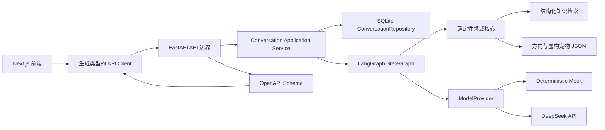

# IMPLEMENTATION_PLAN.md

## 0. 文档状态

- 计划名称：咕噜港Demo实施计划
- 版本：0.2.12
- 状态：Gate 1已批准
- 创建日期：2026-08-04
- 批准日期：2026-08-04
- 输入规格：`specs/SDD_SPEC.md` 0.3.10（Gate 0修订版及页面原型审批门禁已批准）
- 当前阶段：T43展示材料整理已完成；下一项为Phase 8的T44最终全量验证与用户验收
- 门禁：真人演示与Mock证据已分开记录；Phase 8仍须完成最终全量验证与用户验收

本文件描述实施顺序、架构边界、依赖关系、验证门禁和风险控制。它不是原子任务清单，不授权直接编码。

## 1. 计划目标

以风险优先、纵向切片的方式交付：

1. 先证明确定性业务逻辑正确：硬约束、状态、追问、过滤、排序、等级和24小时会话。
2. 再用确定性Mock贯通Agent、API和AI选宠页面。
3. Mock端到端稳定后才接入DeepSeek真人演示。
4. 核心Agent成立后，再补齐宠物平台前端原型外壳。
5. 最后集中完成评测、浏览器检查、文档和演示证据。

不采用“先做完整页面、最后再接Agent”的顺序。那会把最大的不确定性拖到项目末尾，并制造一个看起来完整但核心未经证明的Demo。

## 2. 实施边界

### 2.1 本计划会实施

- Next.js前端原型和AI选宠交互
- FastAPI API服务
- LangGraph显式状态编排
- 应用自主管理的SQLite本地会话
- 结构化本地知识检索
- 确定性硬过滤、评分、等级和问题选择
- DeepSeek与确定性Mock模型适配器
- OpenAPI契约与前端类型生成
- 单元、集成、契约、端到端和评测体系
- README、架构、评测、Bad Case和演示脚本

### 2.2 本计划不会实施

- 账户、登录和跨设备同步
- 真实下单、支付、合同、物流和商家系统
- 真实社区写入、会员付费和订单后台
- 真实宠物、用户或交易数据
- 兽医诊断
- 向量数据库、模型微调或多Agent自治
- 部署和公开仓库；这些仍需单独批准

## 3. 已验证环境与前置事实

### 3.1 当前仓库

仓库已经完成Phase 0脚手架，并存在一批按旧规格实现的Phase 1领域代码和测试。它们是历史实现证据，不自动证明已满足SDD 0.2.6；后续必须通过修订任务和新回归测试逐项对齐。

另发现`START_HERE.md`存在明显乱码。它不是核心规格，但会在初始化阶段修复编码和过时的启动说明，避免新会话读取错误上下文。

### 3.2 当前本机工具

| 工具 | 当前可见版本/状态 | 计划处理 |
|---|---|---|
| Node.js | 24.16.0 | 采用Node 24.x，并在项目文件中约束主版本 |
| pnpm | 11.9.0 | 作为前端唯一包管理器，生成`pnpm-lock.yaml` |
| npm | 11.13.0，PowerShell脚本入口受执行策略影响 | 不作为主要入口；必要时使用`npm.cmd` |
| Python | Codex运行时有3.12.13，但系统`py`没有可用解释器 | 不依赖Codex私有运行时；初始化时用uv管理项目Python 3.12 |
| uv | 当前未安装 | 初始化阶段安装并生成`uv.lock`，执行前按权限规则处理 |

Next.js官方当前要求Node.js至少20.9，当前Node 24满足要求。精确框架补丁版本必须在初始化当天解析、验证并写入锁文件，不在计划文档中伪造。

## 4. 核心架构决策

### AD-01：前后端分离，但保留单仓库

- `frontend/`：Next.js App Router、TypeScript、Tailwind CSS。
- `backend/`：FastAPI、Pydantic、LangGraph和SQLite。
- `data/`：知识、方向档案、具体宠物档案与原型数据。
- `evals/`：固定对话集、期望结果、运行结果和Bad Case。

理由：前端原型和Agent服务变化节奏不同；分离可以清楚表达哪些是真实后端能力，哪些只是本地原型状态，同时仍能由根目录统一验证。

### AD-02：使用LangGraph，不引入LangChain

采用LangGraph `StateGraph`表达已批准的节点、条件边和状态转换；模型调用、检索和匹配通过项目自己的接口注入。

不引入LangChain高层Agent或自由工具循环。LangGraph官方将其定位为低层状态编排运行时，并明确可以脱离LangChain使用。这样能保留可视化状态图和显式路由，又不让框架替代已经批准的确定性业务规则。

### AD-03：应用状态是唯一业务事实来源

首版不使用LangGraph checkpointer作为会话主存储。应用自己的`ConversationRepository`负责SQLite事务、revision、幂等、24小时过期和重置；LangGraph每轮读取一个已验证快照，返回候选新状态，成功后再由仓储原子提交。

理由：

- SDD要求消息、画像、推荐、revision和过期时间原子成功或全部回滚。
- LLM网络调用期间不应持有SQLite写事务。
- LangGraph检查点适合工作流恢复，但不能自动满足本项目自定义的HTTP幂等、滑动TTL和公共错误语义。

后续若需要时间旅行或节点级恢复，再通过ADR评估checkpointer；首版不重复维护两套状态真相。

### AD-04：SQLite保存会话，JSON保存静态知识

- SQLite保存会话状态、消息幂等记录、revision、终态和最小墓碑信息。
- JSON保存只读的方向、宠物档案、知识条目和原型数据，并在启动和测试时通过Pydantic校验。
- 不引入ORM；使用小型仓储接口隔离SQL，降低首版依赖和隐式行为。
- 异步API通过`aiosqlite`访问SQLite。
- 数据库结构使用编号SQL迁移和`schema_version`表管理；每次测试从空临时数据库执行全部迁移，禁止依赖开发者机器上的已有数据库。

过期处理：

1. 每次成功写入更新`last_active_at`和`expires_at`。
2. 访问到已过期活动会话时，先清除消息、画像和推荐载荷，再标记`EXPIRED`。
3. 仅保留不含对话内容的最小终态墓碑24小时，用于稳定返回410；之后可物理删除并返回404。
4. RESET同样立即清除业务载荷，保留短期最小墓碑以支持重复DELETE返回204。

### AD-05：首版RAG使用结构化本地检索

不使用Embedding和向量数据库。检索分两步：

1. 依据物种、照护需求、风险标签和候选ID执行确定性过滤。
2. 对标题、主题和同义词进行受控词项匹配，返回带`sourceId`的知识片段。

检索结果会进入解释模型上下文，因此仍是“检索增强生成”；但候选选择和证据来源可完全测试。以首版8个方向和16个具体档案的规模，引入向量数据库会增加依赖、随机性和解释困难，收益不足。

### AD-06：模型只做理解、措辞和解释

统一`ModelProvider`包含四类结构化操作：

- 提取本轮画像增量
- 表达已经由规则选定的单个问题
- 将结构化推荐事实转为用户可读解释
- 对解释结果做结构化安全复核

DeepSeek和Mock实现同一接口。模型不得决定：

- 下一问题ID
- 硬约束是否成立
- 候选是否过滤
- 内部得分和匹配等级
- 会话状态、revision、TTL或错误码

### AD-07：DeepSeek使用当前官方模型和保守调用模式

真人演示默认：

- `DEEPSEEK_MODEL=deepseek-v4-flash`
- OpenAI兼容基础地址：`https://api.deepseek.com`
- 非流式调用
- 显式关闭thinking模式
- 开启JSON Output
- 所有输出再次经过Pydantic Schema校验

理由：官方当前将`deepseek-v4-flash`列为低延迟、高性价比模型，并已淘汰旧`deepseek-chat`/`deepseek-reasoner`名称。思考模式当前默认开启，但本项目不需要向应用处理或保存reasoning内容；关闭后接口更简单、延迟和成本更可控。

DeepSeek官方同时提示JSON Output偶尔可能返回空内容，因此适配器必须识别空内容、截断和无效JSON；最多进行一次受控重试，仍失败则返回`MODEL_INVALID_RESPONSE`并回滚本轮。

### AD-08：OpenAPI是前后端唯一公共契约

- FastAPI的Pydantic响应模型生成OpenAPI。
- 前端通过`openapi-typescript`生成只读TypeScript类型。
- 生成文件不手工修改。
- CI/根验证脚本重新生成并检查差异，防止API文档和前端类型漂移。
- 前端展示模型可以在生成类型之上做显式转换，但不能重新定义另一套接口字段。

### AD-09：前端不引入全局状态库

AI会话状态以服务端快照为准，页面使用React内建状态和小型`useReducer`管理请求、加载、重试和乐观UI。原型收藏、点赞和购物车使用独立的浏览器本地存储适配器。

首版不引入Redux、Zustand或React Query。当前数据流不需要这些依赖；如果后来出现跨页缓存或复杂失效问题，再以实际证据补充ADR。

### AD-10：静态原型数据与Agent数据严格分层

- `data/agent/`：方向、知识和具体虚构宠物档案，接受Schema校验并参与推荐。
- `data/prototype/`：商品、帖子、套餐和模拟订单，只用于页面展示。
- 宠物市场可以展示Agent档案的公共投影，但不得反向把商品筛选字段当作Agent证据。

## 5. 总体架构



关键约束：

- UI不能直接调用DeepSeek。
- ModelProvider不能直接写会话。
- LangGraph节点不能绕过领域核心修改硬约束结果。
- 原型模块不能调用真实交易接口。
- 内部数字分在公共API序列化前被移除。

## 6. 目标目录

```text
gulu-port-agent/
├── AGENTS.md
├── PROJECT_CONTEXT.md
├── START_HERE.md
├── README.md
├── .env.example
├── .gitignore
├── package.json
├── pnpm-workspace.yaml
├── pnpm-lock.yaml
├── specs/
│   ├── SDD_SPEC.md
│   ├── IMPLEMENTATION_PLAN.md
│   └── TASKS.md                 # Gate 1批准后才生成
├── docs/
│   ├── decisions.md
│   ├── architecture.md
│   ├── evaluation.md
│   └── demo-script.md
├── frontend/
│   ├── src/app/
│   ├── src/components/
│   ├── src/features/
│   ├── src/lib/
│   ├── src/generated/
│   ├── public/
│   └── tests/
├── backend/
│   ├── pyproject.toml
│   ├── uv.lock
│   ├── app/
│   │   ├── api/
│   │   ├── agent/
│   │   ├── domain/
│   │   ├── models/
│   │   ├── providers/
│   │   ├── repositories/
│   │   ├── retrieval/
│   │   └── services/
│   └── tests/
├── data/
│   ├── agent/
│   └── prototype/
├── evals/
│   ├── datasets/
│   ├── results/
│   └── bad_cases/
└── scripts/
    ├── bootstrap.ps1
    ├── dev.ps1
    └── verify.ps1
```

目录可在TASKS阶段按每个切片细化，但不得改变职责边界。

## 7. 依赖与版本锁定策略

### 7.1 前端

运行依赖：

- Next.js、React、React DOM
- Tailwind CSS和`@tailwindcss/postcss`

开发依赖：

- TypeScript、ESLint
- Vitest、Testing Library、jsdom
- Playwright
- `openapi-typescript`

策略：

- 使用官方`create-next-app@latest`创建App Router项目。
- 初始化完成后将所有解析版本写入`pnpm-lock.yaml`，`package.json`记录`packageManager`。
- 不使用浮动版本执行CI或交付验证。
- 异步Server Component优先用Playwright做端到端验证；Next.js官方说明部分单元测试工具对异步Server Component支持仍有限。

### 7.2 后端

运行依赖：

- Python 3.12
- `fastapi[standard]`
- Pydantic v2、`pydantic-settings`
- LangGraph
- HTTPX
- `aiosqlite`

开发依赖：

- pytest、pytest-asyncio、pytest-cov
- Ruff
- mypy

策略：

- 使用uv管理解释器、虚拟环境、依赖组和`uv.lock`。
- FastAPI锁定到初始化时通过测试的具体minor/patch，不单独钉死Starlette；FastAPI官方明确建议锁定已验证的FastAPI版本并让其选择兼容Starlette。
- Pydantic只使用v2接口。
- 每次依赖升级必须先运行完整验证，不在功能实现中顺手升级。

### 7.3 不引入的依赖

- LangChain
- ORM
- 向量数据库和Embedding SDK
- 全局前端状态库
- UI大而全组件库
- 真实支付、认证和对象存储SDK

新增这些依赖需要明确证明当前方案无法满足已批准行为，并先记录决策。

## 8. 配置与密钥

`.env.example`只包含占位符：

```dotenv
MODEL_PROVIDER=mock
DEEPSEEK_API_KEY=
DEEPSEEK_BASE_URL=https://api.deepseek.com
DEEPSEEK_MODEL=deepseek-v4-flash
DEEPSEEK_THINKING_ENABLED=false
SESSION_TTL_HOURS=24
DATABASE_PATH=./var/gulu-port.db
NEXT_PUBLIC_API_BASE_URL=http://localhost:8000
```

规则：

- 测试强制覆盖`MODEL_PROVIDER=mock`。
- 测试进程检测到真实模型提供方时立即失败。
- 后端启动时验证配置；缺少Key时Mock模式可启动，DeepSeek模式必须明确失败。
- 前端环境变量只包含公共API地址，不包含模型Key。
- FastAPI CORS仅允许配置中的前端来源；开发默认`http://localhost:3000`，不使用带凭据的通配符来源。

## 9. 提议命令

以下命令在初始化阶段创建并实际验证后，才升级为README中的正式命令：

```powershell
# 一次性初始化
powershell -ExecutionPolicy Bypass -File scripts\bootstrap.ps1

# 前端
pnpm --dir frontend dev
pnpm --dir frontend test
pnpm --dir frontend lint
pnpm --dir frontend typecheck
pnpm --dir frontend build
pnpm --dir frontend test:e2e

# 后端
cd backend
uv sync --all-groups
uv run fastapi dev app/main.py --port 8000
uv run pytest
uv run pytest --cov=app --cov-report=term-missing
uv run ruff check .
uv run mypy app tests

# 根目录全量验证
powershell -ExecutionPolicy Bypass -File scripts\verify.ps1
```

`verify.ps1`最终必须依次检查：

1. Agent与原型JSON Schema
2. 后端格式、静态检查、单元和集成测试
3. OpenAPI生成与前端类型无漂移
4. 前端Lint、类型、单元测试和生产构建
5. Mock端到端测试
6. 固定评测集

真人DeepSeek调用不进入默认自动化验证，避免费用、网络和随机性污染回归结果。

## 10. 会话并发与事务方案

消息处理流程：

1. 校验API请求、`baseRevision`和`clientMessageId`。
2. 获取当前进程内该会话的短时异步锁。
3. 读取活动会话快照并检查TTL、终态和重复消息。
4. 在数据库事务外运行LangGraph和模型调用，生成候选新状态。
5. 验证完整新状态和公共响应。
6. 使用`WHERE revision = baseRevision`做比较并交换更新。
7. 在同一SQLite事务中写入新状态、幂等响应、`revision+1`和新`expiresAt`。
8. 如果比较失败，丢弃候选结果并返回`REVISION_CONFLICT`。

这样避免在模型网络调用期间锁住数据库，同时保证成功提交是原子的。

幂等记录以`(conversation_id, client_message_id)`为唯一键，保存首次成功的公共响应。失败调用不写成功幂等记录，允许用户重试。

首版只承诺单机、单FastAPI进程。多进程和分布式锁不属于Demo范围；如果部署方案要求多实例，必须先升级存储与并发设计。

## 11. Agent实现分工

### 11.1 LangGraph节点

- `validate_input`
- `extract_profile`
- `merge_profile`
- `detect_blockers_and_conflicts`
- `assess_readiness`
- `select_next_question`
- `retrieve_knowledge`
- `build_directions`
- `filter_pet_candidates`
- `score_and_rank`
- `build_recommendation_facts`
- `generate_explanation`
- `safety_review`
- `finalize_turn`

### 11.2 必须是纯函数或确定性服务

- 槽位合并
- 阻断和冲突检测
- 问题优先级与稳定排序
- 推荐就绪判断
- 方向和宠物硬过滤
- 内部评分与等级映射
- 公共响应去分
- 推荐变化比较
- TTL、revision和错误映射

### 11.3 允许模型参与

- 自由文本到`ProfileDelta`
- 已选定问题的自然措辞
- 基于结构化事实和证据的解释
- 对外文案安全复核

模型输出不能直接成为`ConversationState`；必须经过Schema校验和确定性合并。

## 12. 数据建设策略

### 12.1 先Schema，后数据

先为知识、方向、宠物档案和原型数据定义Pydantic Schema与JSON Schema，再录入内容。所有数据文件进入自动化校验，避免页面或匹配逻辑依赖拼写不一致的标签。

### 12.2 Agent数据最小集

- 8个已批准猫犬方向
- 16个具体虚构宠物档案
- 每个方向有来源、群体倾向、代价和不可保证事项
- 每个具体档案有个体观察来源类型与未知字段
- 覆盖高低运动、不同空间、预算、掉毛、叫声、家庭和经验要求

数据设计必须故意包含“不匹配”样本，否则硬过滤测试没有证明力。

### 12.3 知识来源

实施时优先使用官方动物福利组织、兽医协会、政府或高校兽医资料；只保存短摘要、结构化事实和链接，不复制长文本。每个事实保留本地复核日期。

## 13. 纵向实施阶段

以下是阶段，不是`TASKS.md`中的原子任务。

### Phase 0：工具链与契约地基

目标：

- 建立前后端项目、锁文件、环境示例和根验证入口。
- 固化格式、类型、测试和OpenAPI生成方式。
- 修复`START_HERE.md`乱码并同步Gate状态。

退出条件：

- 前后端空项目可以启动。
- 空测试、Lint、类型检查和构建命令实际通过。
- 根验证脚本能报告每个子步骤。
- 不需要DeepSeek Key即可用Mock模式启动。

### Phase 1：确定性领域核心

目标：

- 保留旧T06至T11的历史记录，新增T06R至T13R-C按SDD 0.2.6重新验收。
- 先写失败测试，再修正状态Schema、槽位合并、明确底线、冲突、3+1动态追问、推荐就绪、评分、等级和公共去分。
- 建立8个方向、16只模拟在售宠物、2个模拟商家及知识Schema。

主要覆盖：AC-001至AC-016、AC-029。

退出条件：

- 全部领域逻辑不依赖LLM或HTTP。
- 只有物种过敏和用户明确说出的绝对底线可以硬排除；时间、关系与养护差距进入等级和解释。
- 3个基础问题加至多1个针对性问题、推荐前过敏确认和未知项处理都有确定性测试。
- 先按“很合拍、值得认识、需要磨合、暂不合适”分级，再在同级内按内部数字分稳定排序。
- 最多展示4只、同一方向最多1只；公开模型无法序列化内部数字分。
- 16只宠物与2个模拟商家的字段、归属、披露语和模拟性质通过Schema与内容测试。

完成证据（2026-08-09）：T06R至T13R-C全部完成；后端88条测试、Ruff、mypy通过，覆盖率95%；项目一键总检查全部通过。匹配规则未调用模型或HTTP，重复运行结果一致，公开模型不包含内部数字分。

### Phase 2：会话仓储与事务

目标：

- 实现SQLite会话、revision、幂等、滑动24小时TTL、过期清除和重置。
- 用可控时钟测试所有时间行为。

主要覆盖：AC-017至AC-021、AC-024。

退出条件：

- 重复消息只提交一次。
- revision冲突不覆盖新状态。
- 失败路径不刷新TTL、不留下半状态。
- RESET和EXPIRED清除对话载荷。

完成证据（2026-08-09）：T14至T17全部完成；SQLite为会话唯一事实来源，24小时TTL、重置、幂等、revision冲突和回滚通过测试。后端104条测试、Ruff、mypy通过，覆盖率93%；项目一键总检查全部通过。

### Phase 3：Mock驱动的LangGraph Agent

目标：

- 连接状态图、确定性节点、结构化检索和Mock Provider。
- 贯通5轮以上动态对话、冲突处理、直接推荐和双层推荐。

主要覆盖：AC-002至AC-013、AC-022、AC-023、AC-025、AC-026、AC-028。

阶段完成证据（2026-08-10）：T18至T22完成；统一Provider契约、确定性Mock、显式LangGraph节点与条件路由，以及画像提取、合并、已确认值保护、冲突优先、动态追问、知识检索、独立方向排序、具体宠物匹配和风险说明均已串联。正常推荐、冲突澄清和过敏后暂不推荐三类5轮以上对话各自连续运行3次且结构一致。后端143条测试、Ruff、mypy通过，覆盖率94%。Phase 3已完成，公共API和页面串联仍待后续阶段。

退出条件：

- 相同夹具重复运行得到相同结构结果。
- 不存在真实网络模型调用。
- 同一首问的不同答案会分叉到不同问题。
- 方向成立但无个体时不会凑数。

### Phase 4：FastAPI契约切片

目标：

- 实现SDD中的全部API、错误结构、幂等和健康检查。
- 生成OpenAPI并建立契约快照/前端类型生成。

实施顺序门禁：

- 只允许先单独实施并验证T23的公共错误格式和配置启动检查。
- T23已完成：Mock模式无Key正常启动；DeepSeek模式缺Key明确失败；健康检查和错误响应使用统一公共结构且不暴露敏感配置。
- T23完成后暂停API编码，进入“UX-01 核心手机页面原型审批”。
- 原型至少覆盖首页、AI对话、画像摘要、推荐前过敏确认、双层推荐结果、修改条件，以及错误／过期／重置反馈。首页采用发现式布局；模拟销量、模拟好评和模拟店铺热度必须在页面级与卡片级明确标为“Demo虚拟数据”，排序仅作演示。
- 用户逐页确认页面结构、功能位置和主要操作流程后，才允许开始T24至T26；具体原型工具和外部平台使用在UX-01开始前另行确认。

退出条件：

- API契约测试覆盖全部状态码。
- OpenAPI响应中无内部数字分、Prompt或敏感配置。
- Mock模式完成创建、对话、修改、推荐、恢复和重置。
- UX-01审批记录存在，且T24至T26的接口契约与已批准原型一致。

### Phase 5：AI选宠前端纵向切片

目标：

- 完成首页主入口、对话页、画像摘要、错误恢复、结果页、修改条件和重置。
- 第一版按手机优先Web App/PWA交付：可通过链接访问，并在支持的浏览器中添加到手机主屏幕；不冒充应用商店原生App或小程序。
- 先只连接Mock后端。
- 页面结构、主要操作流程和视觉方向必须遵守UX-01已批准原型；如需明显修改，先返回用户确认。

退出条件：

- 用户能从首页完成5轮以上流程并看到双层建议。
- 桌面和移动端均可操作。
- 手机端满足PWA清单、添加主屏幕和从桌面图标再次打开的验收；不承诺完整离线能力或应用商店安装包。
- 页面不展示精确分。
- 过期、冲突和模型失败均有可恢复反馈。
- Playwright主路径通过。

### Phase 6：DeepSeek真人演示

目标：

- 接入DeepSeek Provider、JSON Output、超时、一次受控重试和安全回滚。
- 用少量人工脚本验证真人多轮效果，不把结果混入确定性回归基线。

退出条件：

- 没有Key时失败清晰，不影响Mock模式。
- 有Key时完成至少一条5轮以上真人流程。
- 模型无效JSON、空内容、超时均不提交状态。
- 记录模型名、日期、调用结果和费用观察。

### Phase 7：完整前端原型外壳

目标：

- 补齐宠物市场、用品、社区、会员中心和“我的”。
- 使用独立原型数据与浏览器本地状态。
- 所有未开放业务动作显示统一Demo提示。

主要覆盖：AC-027。

退出条件：

- 全部路由可达。
- 明显按钮100%有反馈。
- 没有假支付、假订单或假发帖成功。
- AI选宠仍是首页最突出行动点。

### Phase 8：评测、加固与展示材料

目标：

- 完成至少30类固定案例、指标、Bad Case和回归证据。
- 完成真实浏览器、响应式、控制台和网络检查。
- 补齐README、架构图、流程图、决策、评测和演示脚本。

退出条件：

- 根验证全绿。
- Gate 5指标达到SDD目标或明确列出未达项。
- 对外表述与真实实现层级一致。
- 用户能够依据演示脚本解释关键产品与技术决策。

## 14. 检查点与停止条件

### Checkpoint A：地基

Phase 0后检查工具链和锁文件。任何命令未实际通过，不进入业务实现。

### Checkpoint B：领域可信

Phase 1至2后检查硬约束、排序、TTL、幂等和事务。核心纯逻辑不可信，不接LLM。

### Checkpoint C：Mock Agent MVP

Phase 3至5后完成Gate 3候选验收。Phase 3的Mock多轮流程已稳定；Phase 4和Phase 5完成前仍不接DeepSeek。

### Checkpoint D：真人模型

Phase 6后单独比较Mock契约和真人表现。模型效果不足时优先修提示、Schema和Bad Case，不修改硬规则来迎合输出。

### Checkpoint E：完整Demo

Phase 7至8后执行全量浏览器和评测验收。任何测试、构建或静态检查失败，不宣布完成。

## 15. TDD证据要求

每个后续原子任务必须记录：

- 对应SDD条款和AC编号
- RED：测试名称、失败命令和预期失败原因
- GREEN：最小实现后的通过命令
- REFACTOR：重构后相关与全量结果
- 触及文件
- 已知限制

对于UI视觉和浏览器行为，RED可以是失败的组件/E2E测试或明确的浏览器验收记录，但不能用“我看起来觉得可以”替代。

## 16. 并行与顺序

必须顺序完成：

- Schema -> 领域逻辑 -> Agent图 -> API -> 前端API接入
- Mock端到端 -> DeepSeek接入
- Gate 1批准 -> TASKS -> 任务批准 -> 生产代码

契约稳定后可以并行：

- 原型页面与Agent后端
- 知识/档案内容录入与前端设计Token
- 文档、评测夹具和已实现行为的测试补强

共享API、状态Schema、设计Token或数据Schema的工作不能无协调并行。

## 17. 主要风险与缓解

| 风险 | 影响 | 缓解 |
|---|---|---|
| 先做漂亮外壳，核心Agent最后失败 | 高 | 风险优先阶段；Mock Agent和AI页面先于完整原型 |
| LLM输出空JSON或结构漂移 | 高 | JSON Output + Pydantic校验 + 一次受控重试 + 原子回滚 |
| Mock替代了业务逻辑 | 高 | Mock只实现ModelProvider；契约测试证明其他模块同路径 |
| LangGraph状态和数据库状态双重真相 | 高 | 不用checkpointer做首版主存储；应用仓储是唯一真相 |
| SQLite并发覆盖 | 中 | 单会话锁 + revision比较交换 + 唯一幂等键 |
| 知识不足却生成确定性结论 | 高 | sourceId强制、扩大检索一次、无结果回滚 |
| 向量检索使结果不可解释 | 中 | 首版结构化确定性检索，不上向量库 |
| 品种倾向被写成个体保证 | 高 | 双层Schema、分别取证、安全回归用例 |
| DeepSeek模型名再次变化 | 中 | 环境变量配置；接入和演示前复核官方模型页 |
| 前端与API字段漂移 | 中 | OpenAPI生成类型和漂移检查 |
| 原型范围膨胀成电商后台 | 高 | Level B/C边界和统一未开放反馈 |
| Windows工具链不可复现 | 中 | uv管理Python、pnpm锁定、PowerShell根脚本 |
| `START_HERE.md`乱码误导新会话 | 中 | Phase 0修复UTF-8并校对门禁说明 |

## 18. 需要记录的后续决策

实施过程中创建或更新`docs/decisions.md`，至少记录：

1. LangGraph只做编排、应用仓储做状态真相。
2. 首版选择结构化检索而非向量库。
3. SQLite单进程范围和未来扩展触发条件。
4. OpenAPI生成前端类型。
5. DeepSeek默认模型和关闭thinking模式。

如果实际证据推翻这些决策，先更新SDD中受影响的业务行为，再更新计划和测试，不静默偏航。

## 19. Gate 1批准后如何进入TASKS

本计划获批后，才生成`specs/TASKS.md`。任务拆分必须满足：

- 每个任务对应一个小型纵向或基础切片。
- 通常触及不超过5个文件；超过则继续拆分。
- 每项写明SDD/AC映射、依赖、验收、RED命令和完整验证。
- 每2至3项设置检查点。
- 第一批任务只覆盖Phase 0，不直接跳到页面或DeepSeek。

生成TASKS不等于授权编码；用户批准任务批次后才进入TDD实现。

## 20. Gate 1批准清单

- [x] 同意风险优先顺序：领域核心和Mock Agent先于完整原型外壳
- [x] 同意使用LangGraph但不引入LangChain
- [x] 同意应用SQLite仓储作为唯一会话事实来源
- [x] 同意首版使用结构化本地检索，不使用向量库
- [x] 同意DeepSeek默认`deepseek-v4-flash`、关闭thinking、启用JSON Output
- [x] 同意OpenAPI生成前端类型
- [x] 同意Node 24、Python 3.12、pnpm和uv版本锁定策略
- [x] 同意Phase 0至Phase 8实施顺序和检查点
- [x] 同意计划批准后只生成TASKS，任务批准前仍不编码

批准记录：用户于2026-08-04回复“同意这个顺序（我有deepseek的api）”。用户同时确认具备DeepSeek API访问权限；真实Key不得写入聊天、文档或仓库，只在接入阶段放入本机`.env`。

批准后统一表述：

> Gate 0修订规格与UX-01最终版已批准；T06R至T43已实现并验证。T35已使用`DeepSeek-V4-Flash-0731`完成5轮受控真人流程，Phase 6与Phase 7通过；T41固定评测已执行34条Mock案例且无Bad Case，T42已完成七页浏览器、键盘、响应式与PWA清单审查，T43已完成展示材料整理。下一项为T44最终全量验证与用户验收。实体手机系统安装仍需在完整前后端可由HTTPS访问后手工确认；公开网址仍是前端原型分享版，不等于完整后端已部署。

## 21. 官方资料依据

- [Next.js安装与系统要求](https://nextjs.org/docs/app/getting-started/installation)
- [Next.js测试指南](https://nextjs.org/docs/app/guides/testing)
- [Tailwind CSS的Next.js安装指南](https://tailwindcss.com/docs/installation/framework-guides/nextjs)
- [FastAPI版本锁定建议](https://fastapi.tiangolo.com/deployment/versions/)
- [FastAPI测试指南](https://fastapi.tiangolo.com/tutorial/testing/)
- [FastAPI项目与uv锁文件说明](https://fastapi.tiangolo.com/deployment/docker/)
- [LangGraph概览](https://docs.langchain.com/oss/python/langgraph/overview)
- [LangGraph Graph API](https://docs.langchain.com/oss/python/langgraph/graph-api)
- [LangGraph持久化与线程](https://docs.langchain.com/oss/python/langgraph/persistence)
- [DeepSeek当前模型与价格](https://api-docs.deepseek.com/quick_start/pricing)
- [DeepSeek JSON Output](https://api-docs.deepseek.com/guides/json_mode/)
- [DeepSeek Thinking Mode](https://api-docs.deepseek.com/guides/thinking_mode)
- [Python 3.12 sqlite3事务控制](https://docs.python.org/3.12/library/sqlite3.html)
